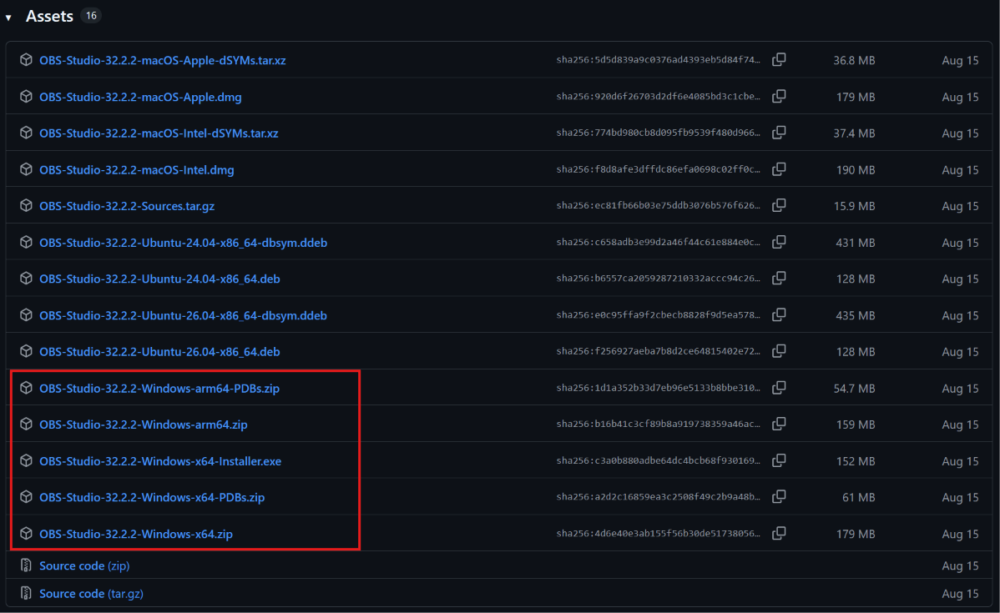
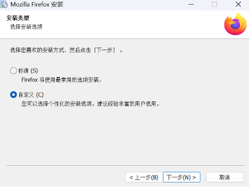
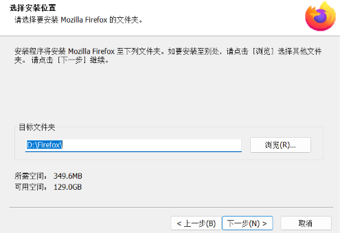
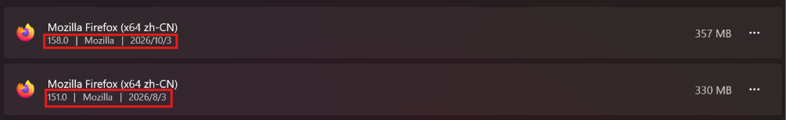

# 5.1 安装与卸载软件


*编者注：AI写的内容均正确，就是这文风……一言难尽。*

在许多初学者的印象里，在电脑上“安装软件”就像用微波炉热饭：双击安装包，眼睛一闭，手里鼠标对着“下一步”、“允许”、“快速安装”一顿狂点，最后大功告成！

然而，几天过后你可能会发现：
- 桌面莫名其妙多出了四五个“某某传奇”、“某某管家”和满屏闪烁的弹窗广告；
- 电脑的 C 盘亮起了触目惊心的红色警报，连存个作业文档都提示空间不足；
- 想删软件时随手把桌面图标丢进回收站，结果软件在后台依然欢快地自启……

**安装软件其实是一门既简单又讲究的“技术活”！** 只要掌握了几个核心原则，你就能彻底告别流氓软件全家桶，让你的电脑干干净净、运行如飞。

本节我们将以广受好评的开源浏览器——**Mozilla Firefox（火狐浏览器）** 为例，带大家从下载、挑选版本、规划路径到最终体面卸载，走一遍最规范、最优雅的软件生命周期。

---

## 1. 认识安装包：.exe 与 .msi 都是何方神圣？


当我们从网上把软件下载下来时，通常会得到一个文件。在 Windows 中，最常见的软件安装包格式有两种：`.exe` 和 `.msi`。（如果不确定文件后缀是什么，请参考[2.4 - 后缀名](../系统/后缀名(Windows10版).md)开启后缀名显示）。

### 1.1 `.exe`（可执行文件）
这是最最常见的安装包形态。开发者通常会把安装程序、界面动画、甚至个性化设置打包进一个 `.exe` 中。
- **优点**：界面生动丰富，安装过程可以做得很花哨。
- **注意点**：正是因为开发者“自由度太高”，某些不规范的国内软件最喜欢在 `.exe` 安装向导里偷偷藏匿“勾选项”，稍不留神就会顺便给你装上一整套全家桶。

### 1.2 `.msi`（Windows Installer 数据包）
这是微软官方推出的一套标准的 Windows 安装包格式。
- **优点**：规整、严谨。通常遵循 Windows 标准的安装流程，几乎**绝不会**附带流氓捆绑软件，也是企业和系统管理员给批量电脑部署软件时的最爱。

>[!TIP]
>除了这两种安装包，你以后可能还会遇到所谓的**绿色版 / 免安装版 / 便携版（Portable）**。这种软件通常是一个压缩包（`.zip` 或 `.7z`），解压后直接双击里面的主程序就能运行，不会在系统注册表里写入过多信息。就像装在铅笔盒里的文具，拿出来就能用，不要了直接删掉文件夹即可。

---

## 2. 版本选择困难症：amd64、x86、ARM 怎么选？


去某些软件（或者开源社区）的下载页面时，你会看到密密麻麻的一串版本名称：`x86`、`x64`、`amd64`、`arm64`……让人瞬间满头问号：我到底该点哪一个？

<!-- 图片占位符：某开源软件下载列表截图，圈出包含 x86、x64、amd64 等选项的表格 -->


我们用最接地气的话来解释这些字母代号：

| 代号名称 | 适用群体与说明 | 你的选择指南 |
| :--- | :--- | :--- |
| **x64 / x86_64 / amd64** | **现代 64 位 PC 处理器的通用标准**。目前绝大多数 Windows 笔记本和台式机都属于此类。 | **闭着眼睛直接选它！** |
| **x86 / 32-bit / i386** | 32 位老旧系统架构。最大只支持 4GB 内存，属于历史文物。 | 除非你的电脑是十多年前的老古董，否则**不要选**。 |
| **ARM64 / AArch64** | 采用 ARM 架构处理器的 Windows 电脑（如高通骁龙处理器的轻薄本、部分 Surface 等）。 | 普通台式机和 Intel/AMD 笔记本**请勿选择**。 |

>[!TIP]
>**冷知识八卦：为什么我的电脑明明用的是 Intel 的 CPU，却要下载叫 `amd64` 的版本？**\
>这完全是一段商业竞争的趣味历史！当年 32 位时代（x86）由 Intel 称霸，但到了向 64 位演进的关键时刻，是竞争对手 AMD 率先设计出兼容老软件且优秀的 64 位架构（AMD64）。后来 Intel 也全面采用了这套指令集规范。所以在很多开源软件（如 Firefox、VS Code、Python）的命名规范里，`amd64` 就成了 64 位 PC 版的代称。放宽心，Intel CPU 跑 `amd64` 丝滑无比！

如果你不确定自己的电脑到底是 64 位还是 32 位，可以按下快捷键 `Win + Pause/Break`（见[硬件/键盘](../硬件/键盘.md/#173-键盘的布局)），或者打开系统 **“设置” -> “系统” -> “系统信息 / 关于”**，查看里面的 **“系统类型”**。

---

## 3. 安装包去哪了？浏览器的默认下载路径


点击了下载按钮之后，浏览器提示“下载已完成”，但关掉网页后，刚才下载的那个文件跑哪儿去了呢？

### 3.1 默认：Downloads（下载）文件夹
Windows 默认为每个用户准备了一个专门放网络下载内容的仓库——`下载`（Downloads）文件夹。
- 它的物理磁盘路径通常位于：`C:\Users\【你的用户名】\Downloads`。
- 在[2.2 - 文件资源管理器](../系统/文件资源管理器(Windows10版).md)的左侧快捷导航栏中，直接点击那个带有向下箭头的 **“下载”** 文件夹即可找到。

### 3.2 召唤秘籍：快捷键 `Ctrl + J`
不管你用的是 Edge、Chrome 还是 Firefox 浏览器，在浏览器界面按下键盘上的 **`Ctrl + J`**，都会立即呼出下载历史管理窗口！点击文件名旁边的“文件夹”图标，就能秒开该文件所在的位置。

>[!TIP]
>如果你经常从网上下载大文件（比如几个 G 的游戏安装包），这些文件会不知不觉吃光系统盘空间。建议在浏览器设置里把下载路径修改到 D 盘，或者勾选 **“每次下载前都询问保存位置”**，做个心里有数的用户！

---

## 4. 黄金三大保命法则：安装路径的讲究


这是本教程最关键的一个知识点！许多人的电脑用着用着卡死、乱成一锅粥，罪魁祸首就是安装软件时**闭着眼睛一路狂按“快速安装”**。

记住以下三条保命铁律：

### 法则一：尽量安装在非 C 盘（拯救系统盘）
C 盘是 Windows 操作系统的安身立命之所，系统运转需要大量的临时缓存和虚拟内存。如果软件全挤在 C 盘，C 盘一旦“飘红”，电脑就会肉眼可见地变卡。
- **推荐做法**：如果电脑有固态或机械硬盘分区分出的 `D 盘`，可以在 D 盘建立一个专门装软件的母目录，例如 `D:\Program Files\` 或 `D:\Software\`，以后所有软件都安置在这里。

### 法则二：绝对不要直接装在盘符根目录下！
**重点警告：千万不要把安装路径直接填成 `D:\` 或 `E:\`！**
- **为什么？** 一个软件通常包含成百上千个小文件（`.dll`、`.dat`、配置文档等）。如果直接装在 `D:\` 根目录，这些文件会瞬间像天女散花一样铺满整个盘，你的 D 盘将变成毫无秩序的垃圾堆！
- **更可怕的后果**：很多软件在卸载时，执行的逻辑是“清空当前安装目录”。如果你的安装目录是 `D:\`，某些写得不够严谨的卸载程序可能会直接**将整个 D 盘的内容全盘格式化清空**！无数新手都为此付出过血的教训。

### 法则三：绝对不要安装在非空文件夹中！
不要偷懒把新软件直接塞进已经有其他文件的文件夹（比如把 Firefox 塞进已有的 `D:\Program Files\WeChat\` 里）。
- 文件名称冲突可能导致原软件损坏；
- 卸载其一可能会误删另一个软件的关键文件，造成“同归于尽”。
- **黄金标准**：**一个软件一个独立专属文件夹**！比如：`D:\Program Files\Mozilla Firefox\`。

---

## 5. 实战演练：手把手安装 Mozilla Firefox


学完了理论，我们马上以安全、开源、无流氓捆绑的 **Firefox（火狐浏览器）** 为例进行一次标准演练。

### 步骤 1：寻找真身（认准官方网站）
在搜索引擎中搜索软件时，务必警惕各类标注着“广告”、“高速下载器”、“某某软件园”的冒牌链接（详见[3.1.5.3 - 躲避广告内容](../常用软件/浏览器.md#3153-躲避广告内容)）。
- Firefox 官方国际网址为：`https://www.firefox.com/zh-CN/download/all/desktop-release/`
- 选择Windows 64bit / Windows 64bit MSI - 中文简体，然后点击 **“下载 Firefox”** 按钮。

<!-- 图片占位符：Firefox 官方网站首页，醒目的蓝色/渐变色“下载 Firefox”按钮 -->


### 步骤 2：找到安装包并运行
下载完成后，按下 `Ctrl + J` 打开下载列表，点击在文件夹中显示。你会看到一个形如 `Firefox Installer.exe` 或完整安装包 `Firefox Setup xx.x.exe` 的文件。
双击启动它！如果系统弹出“用户账户控制（UAC）”窗口提示“你要允许此应用对你的设备进行更改吗？”，请点击 **“是”**。

### 步骤 3：捕捉狡猾的“自定义安装”按钮
**敲黑板！这是避开流氓捆绑的最核心技巧！**
几乎所有软件安装向导的首页，都会把一个大大的“快速安装 / 一键安装”按钮放在正中间吸引你点下去。但只要你稍微留心，就会在角落或者下方发现不起眼的小蓝字：**“自定义安装”**、**“选项”** 或 **“高级设置”**。

<!-- 图片占位符：Firefox 安装欢迎界面，用红框标出“选项”或“自定义”按钮所在位置 -->


点击 **“选项 / 自定义”**，你才能拿回这台电脑的真正掌控权！

### 步骤 4：优雅地修改安装路径
进入自定义界面后，你会看到默认路径通常是：
`C:\Program Files\Mozilla Firefox`

<!-- 图片占位符：安装路径设置界面，展示将 C 改为 D 的输入框与“浏览”按钮 -->


此时你可以点击 **“浏览”** 按钮挑选位置，也可以直接把最前面的字母 `C` 改成 `D`：
`D:\Program Files\Mozilla Firefox`
> 安装程序检测到该文件夹不存在时，会自动为你创建好这个专属小单间，干净利落。

### 步骤 5：快捷方式与完成
检查界面上的其他勾选项（也可能在安装完成后的结束界面）：
- “创建桌面快捷方式”（建议勾选，方便日常打开）；
- “添加到任务栏”（可选）；
- “开机自启动”（浏览器类软件通常不建议开机自启，把启动时间还给系统）。

确认无误后，点击 **“安装”**。稍等片刻进度条走完，点击完成。你的桌面上就会出现一只可爱的抱球小狐狸图标了！

---

## 6. 体面地告别：如何正确彻底地卸载软件？


电脑用久了，某些软件不再需要了。很多电脑小白在这个环节往往会犯下一个经典错误：**直接对着桌面上的图标按 Delete 键**，或者**直接在资源管理器里强行把整个文件夹删掉**。

>[!CAUTION]
>**为什么不能“直接删除”？**\
>桌面图标只是一个“快捷方式”（相当于路标），删掉路标，房子还在！\
>而如果直接删除安装文件夹，软件之前在 Windows 系统注册表、系统服务、右键菜单里注入的设置并不会被清理。这会导致：
>- 桌面图标偶尔变成白块；
>- 各种未知程序报错；
>- 残留无家可归的垃圾配置，越积越多。

要想干干净净地跟软件说再见，请遵循以下标准卸载流程：

### 推荐方法：通过 Windows“设置”卸载（最规范）

这是微软官方推荐、最不容易出错的方式：

1. 按下快捷键 `Win + I`（或点击任务栏“开始”菜单 -> 点击齿轮状的 **“设置”**）；
2. 点击进入 **“应用”** 模块：
   - **Windows 10**：点击 **“应用和功能”**；
   - **Windows 11**：点击 **“安装的应用”**。
3. 在顶部的搜索框中输入 `Firefox`（或你要卸载的软件名字）；
4. 找到软件后：
   - 在 Windows 10 中：直接左键单击它，点击弹出的 **“卸载”** 按钮；
   - 在 Windows 11 中：点击右侧的 **“三个小点 (...)”**，选择 **“卸载”**。

<!-- 图片占位符：Windows 设置界面中搜索并点击卸载 Firefox 的过程截图 -->


>红框内从左到右分别为版本号、开发者和最近更新日期。

5. 此时会唤起 Firefox 官方的卸载向导，按照屏幕提示一步步点击“下一步” -> “完成”。

>注意有些软件卸载时也会埋坑，下载其他软件，请务必仔细检查。

>[!TIP]
>如果某天 Windows 设置打不开，你也可以使用经典快捷指令：按下键盘上的 **`Win + R`** 打开运行窗口，输入 `appwiz.cpl` 并回车，就能一秒直达经典的“控制面板 - 程序和功能”卸载界面，在那里双击软件同样可以干净卸载！\
>编者注：如果使用Win11，我其实推荐使用appwiz（控制面板），因为设置内的软件管理加载太慢了……

---

## 7. 避坑总结口诀

学完这一课，下次再给电脑安装新软件时，默念这首“保命打油诗”，保你电脑清爽无忧：

```text
官网正品认得准，流氓李鬼不沾身；
架构闭眼选 x64，下载去 Ctrl+J 寻；
莫把根目当窝巢，独立单间装得好；
拒绝无脑下一步，体面卸载去设置！
```